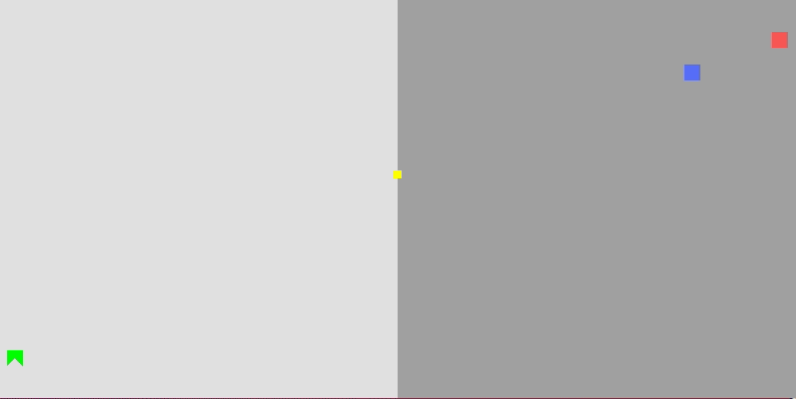
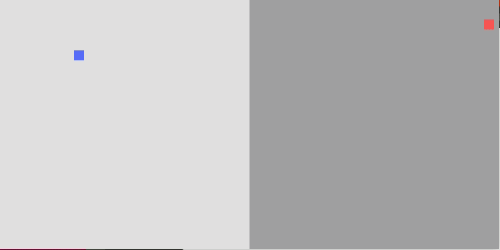
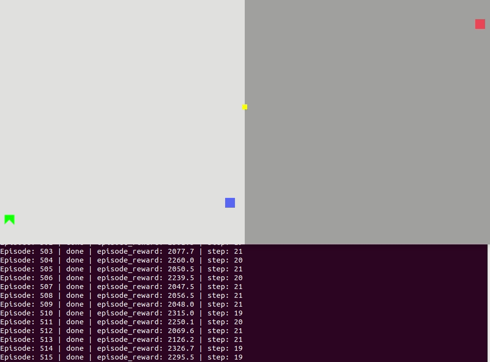
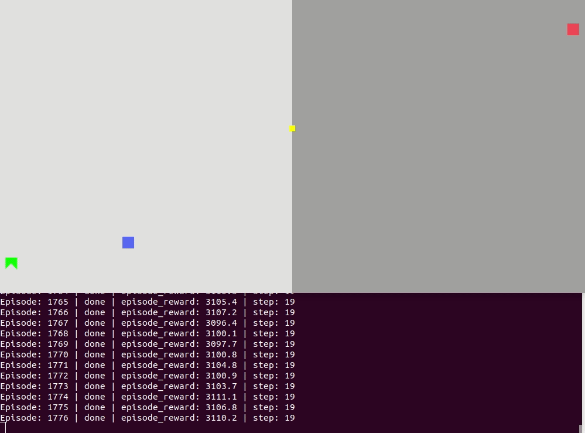
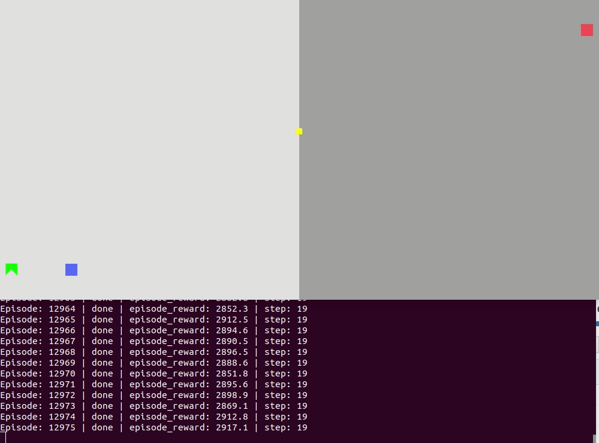
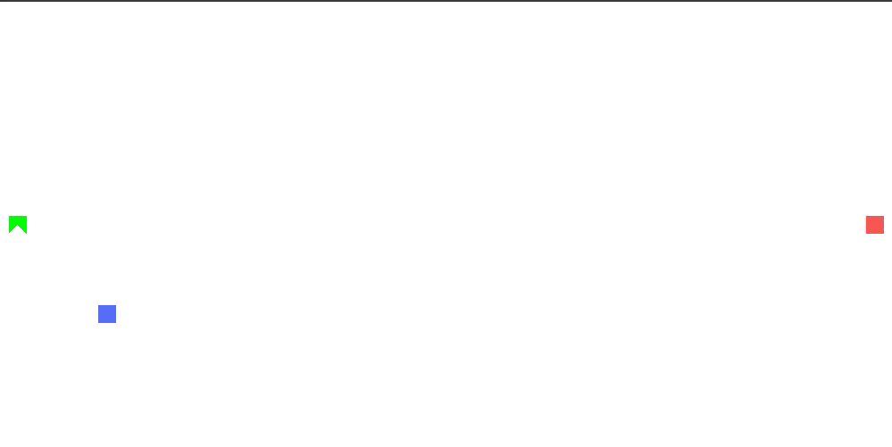
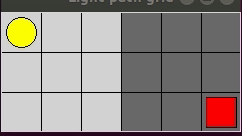

# Reinforcement Learning
Reinforcement learning is about agent, environment, action, and reward: In an "environment"(or, a playfield), the deep learning neural network controls the "action" of an "agent" of our interest so that in the end the agent gets the highest "reward"! 
Take Mario game as an example, Super Mario himself is the agent, the map of the game is the environment and neural network gets the game controller to control our Mario's actions to achieve best reward--the highest game score.

In this project, we want to use reinforcement learning along with the Principle of least action to explore fundamental problems in Physics!
In physics, Action is the integral of Lagrangian over time. Nature tends to take the path where Action is smallest--principle of least action.

Our idea is simple, use reinforcement learning to minimize Action!

Ideas are from dissusions between Joshua Yao-Yu Lin(https://github.com/joshualin24) and me!
I learnt the basics of coding in reinforcement leanring from Morvan Zhou's Reinforcement Learning tutorial https://morvanzhou.github.io. Some code are modified from his examples(Maze and RobotArm).

 # Light Path--Principle of least action in reinforcement learning

- Light = blue box

- Initial position = yellow box

- final position = red box

- Theoretical incident point = yellow box, calculated by Snell's Law

- White background indicates index of refraction=1

- Grey background indicates index of refraction=1.3

#### Physics: 

Light travels at different speeds in materials with different index of refraction. Given initial and final position, light travels the path which takes shortest time. This is the reason behind the bending of light beams when light passes through the interface of two materials. The angles of incidence and refraction obeys Snell's Law, so that the "lightpath" will be shortest.

#### Environment:

Our agent--light(or a photon) can move freely in a 2-D continous map. i.e. it can move any Delta x and Delta z in x and z direction. Here it is just doing random brownian motion before any neural network training.

#### Reward: 

- Within each episode(one run of training), we calculate the time consumed along the path.
- Final reward∝ - time consumed. 
- Final reward is zero if light does no reach goal position at all.
- Intermediate reward. We give some intermediate reward if it moves closer to the goal position. This intermediate reward greatly accelerates the training process at early stage. (so that it won't doing all brownian motions for very first few hours)

#### Training in process:

#### Flat surface
 

Here we can see that reinforcement learning is not performing better on this simplest flat surface than on a more complicated two-material interface. This actually demonstrates the advantage of mechine learning--the complexity of a potential field (here the distribution of index of refraction) does not effect training efficiency and accuracy. With reasonably large number of training episodes, reinforcement learning should give a good answer for any complicated fields.

#### Reinforcement learning algorithm

We are here using DDPG, Deep Deterministic Policy Gradient. https://spinningup.openai.com/en/latest/algorithms/ddpg.html
 
#### Future
- Free fall trajectory (Beta version code available here. Better training algorithms and longer training time should make it work nicely)
- **General relativity geodesics--ongoing work: lightpath around a Schwarzschild black hole**
- Feynman's Path Integral

 ## Light Path--grid with DQN
 

- With only a few (~100 train runs) our light finds the best availble route where minimize steps on grey grid and maximize steps on white grid.
- This is the discountious version of lightpath, and is done before the continous version.
- We used Deep Q-Network
